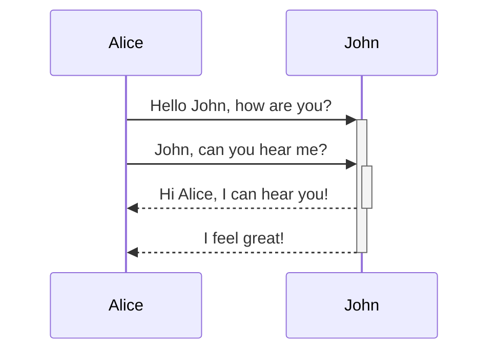

# Obsidian Format Guide
Quick list of iterms for styling Obsidian notes

## Internal Linking
```
Internal linking: [[link]]
```

## Embeds
```
![[Link#Embded File]]
```

## Headers
```
# This is a heading 1
## This is a heading 2
### This is a heading 3 
#### This is a heading 4
##### This is a heading 5
###### This is a heading 6
```

## Emphasis
Single = Italic
Double = Bold

```
*This text will be italic*
_This will also be italic_

**This text will be bold**
__This will also be bold__
```

## Block Quotes
``
```
> Human beings face ever more complex and urgent problems, and their effectiveness in dealing with these problems is a matter that is critical to the stability and continued progress of society.
```

> Human beings face ever more complex and urgent problems, and their effectiveness in dealing with these problems is a matter that is critical to the stability and continued progress of society.

## Task List
```
- [x] #tags, [links](), **formatting** supported
- [x] list syntax required (any unordered or ordered list supported)
- [x] this is a complete item
- [?] this is also a complete item (works with every character)
- [ ] this is an incomplete item
- [ ] tasks can be clicked in Preview to be checked off
```

- [x] #tags, [links](), **formatting** supported
- [x] list syntax required (any unordered or ordered list supported)
- [x] this is a complete item
- [?] this is also a complete item (works with every character)
- [ ] this is an incomplete item
- [ ] tasks can be clicked in Preview to be checked off

## Math

Obsidian uses [Mathjax](http://docs.mathjax.org/en/latest/basic/mathjax.html)

```
$$\begin{vmatrix}a & b\\
c & d
\end{vmatrix}=ad-bc$$
```

$$\begin{vmatrix}a & b\\
c & d
\end{vmatrix}=ad-bc$$

## Callouts
```
> [!INFO]
> Here's a callout block.
> It supports **markdown** and [[Internal link|wikilinks]].
```

> [!INFO]
> Here's a callout block.
> It supports **markdown** and [[Internal link|wikilinks]].

## Diagram
```
\```mermaid
sequenceDiagram
    Alice->>+John: Hello John, how are you?
    Alice->>+John: John, can you hear me?
    John-->>-Alice: Hi Alice, I can hear you!
    John-->>-Alice: I feel great!
\```
```


