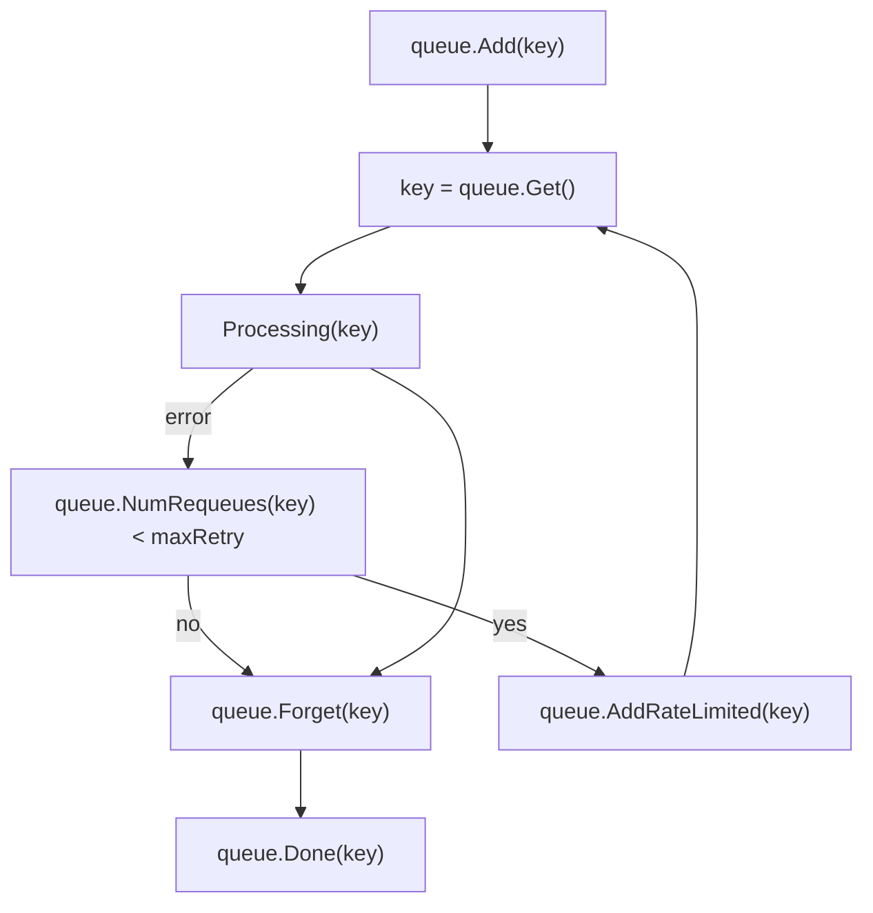

# Workqueue
#k8s 

finish me

## Workqueue Workflow

```mermaid
graph TD;
     A["queue.Add(key)"] --> B["key = queue.Get()"]
	 B --> C["Processing(key)"]
	 C -- error --> F["queue.NumRequeues(key) < maxRetry"];
	 F -- no --> D["queue.Forget(key)"];
	 F -- yes -->H["queue.AddRateLimited(key)"];
	 H --> B;  
	 C --> D;  
	 D --> E["queue.Done(key)"];
```
